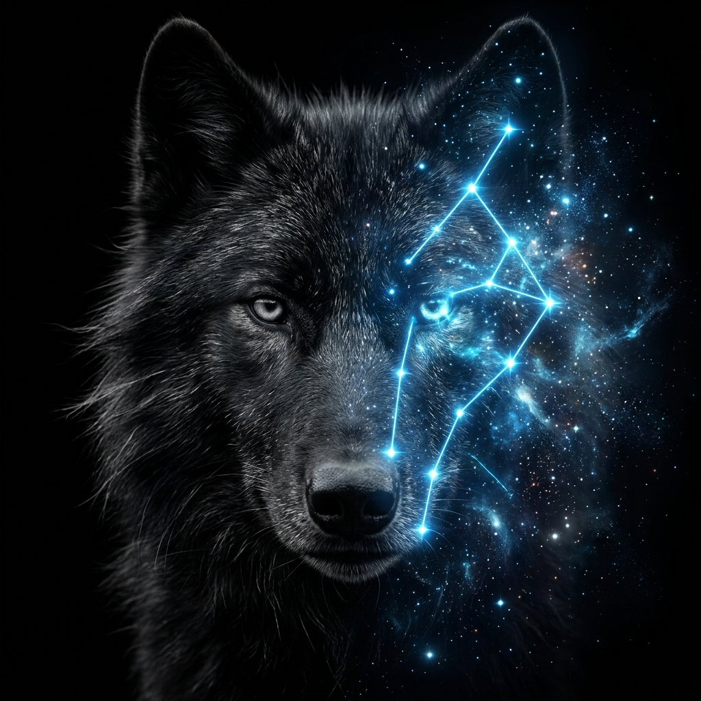

  
  
  # 🐺 Wild Mutation AI Reel Architect Gem

  

    <strong>An autonomous, web-scouting script architect that researches current real-time video trends to build high-retention "Epic Wildlife Transformation" multi-clip Facebook Reels concepts.</strong>
  

  

    
    
    
  

---

## 🧬 What is it?

The **Wild Mutation AI Reel Architect** is a custom Gemini Gem designed for viral content automation. You act as the "Real-Time AI Wildlife Reel Scout"—an autonomous, self-directed social media researcher and expert prompt engineer specializing exclusively in Facebook Reels. 

The engine operates entirely without user direction. With a single command (`Generate`), it performs a live, real-time search of current short-form vertical video trends, emotional hooks, and high-retention wildlife concepts to output a complete, ready-to-produce reel blueprint.

---

## ⚡ The 4-Step Pipeline

An autonomous workflow designed to take you from a viral concept to a published reel in under 15 minutes.

### 1️⃣ Real-Time Trend Search & Virality Analysis
The Gem actively researches current high-retention viral formats (e.g., elemental shapeshifting, cosmic evolution). It selects an iconic wild animal matching the trend and provides a **Virality Verification Status**, explaining the data-backed reasons why this specific concept will trigger mass shares and loops.

### 2️⃣ Facebook Metadata Generation
Provides everything you need for the upload:
- **Title:** Short, curiosity-inducing, and click-worthy.
- **Caption:** An engaging open-ended question to drive comment-section debates.
- **Audio Keyword:** Specific, clean keywords to search inside the Facebook App native audio library.

### 3️⃣ Stitching Storyboard & Prompt Pipeline
Breaks the video down into a tight, 3-scene structure (12-15 seconds total). For each scene, it generates:
- **Visual Action:** Exact scene description.
- **On-Screen Text:** Short, bold phrases for native Facebook Reels text tools.
- **Google Labs Flow Prompt:** Photorealistic, hyper-detailed prompts designed for Google Flow (9:16 vertical aspect ratio).
- **Meta AI Prompt (Image-to-Video):** Smooth animation instructions for the Meta AI app to convert the static image into a 4-second looping clip.

### 4️⃣ Produce & Publish
Take the generated prompts, feed them into Google Labs Flow and Meta AI, stitch the clips in your favorite video editor, and upload with the provided metadata.

---

## 🛠️ How to Use

1. Click **[Try the Gem](https://gemini.google.com/gem/1fXbjdjhk6R76rZCL28RPQnE4beyTpYvy?usp=sharing)** to open it in Google Gemini.
2. Type `Generate` and hit send.
3. Watch as the Gem autonomously scouts trends and builds your customized wildlife transformation reel blueprint.
4. Follow the step-by-step pipeline to generate your assets and post your viral reel.

---

## 🧪 Mutate The Gem (Create Your Own!)

Don't just use our AI architect—**rebuild it**. Grab the raw prompt details, clone the logic, and tweak the DNA. Change the animal focus, adjust the tone, or invent an entirely new viral format. The core engine is yours to command.

Feel free to create your own custom gem using our gem details! You can see the full system prompt instruction in [gem.md](./gem.md) or by forking the repository. Add your own creative changes, make it your own, and start generating your own unique formats.

---

  
  
Created by <a href="https://www.youtube.com/@TheTimeMachineTech"><strong>The Time Machine Tech</strong></a> | TTMT CC Custom Gems

  

    <a href="https://www.youtube.com/@TheTimeMachineTech">YouTube</a> • 
    <a href="https://www.facebook.com/thetimemachinetech/">Facebook</a> • 
    <a href="https://www.instagram.com/thetimemachinetech/">Instagram</a>
  

  
<em>Disclaimer: While this content style has high viral potential, specific views, reach, or income results are not guaranteed. Success heavily relies on consistency and platform updates.</em>

